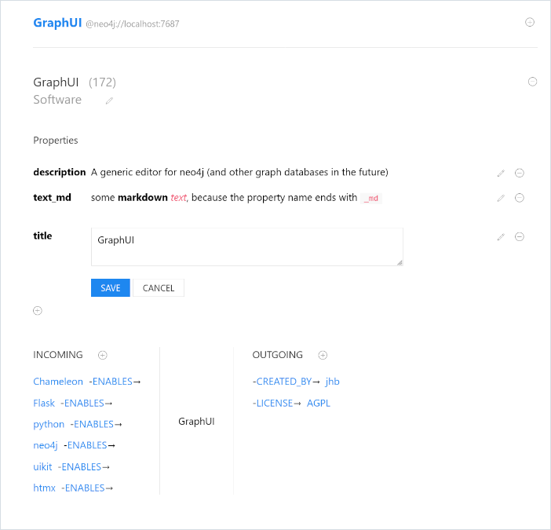

# GraphUI

*A python/flask based generic neo4j editor*



It allows:

- create and delete nodes
- create and delete edges
- edit, add and remove properties on nodes and edges
- edit the labels of nodes

It doesn't require any preparation of your data (but apoc needs to be installed at the moment)

## Status

- **This is a alpha version** - it works, but a lot is missing:
  - logging
  - error handling
  - layout bugs
  - packaging
  - tests
  - etc.

- The full-text search doesn't scale, but works very nicely and complete on a small graph (like the movie graph)

## Installation

- Install a neo4j database
- Install apoc into it
- Then, for the moment, in a Linux or MacOS environment:
    
    ```bash
    cd <some dir>
    python3 -m venv venv
    source venv/bin/activate
    git clone https://github.com/jhb/graphui.git
    cd graphui
    pip install -r requirements.txt
    cd graphui
    cp .env.dist .env
    # adapt .env to your needs
    python app.py    
    ```
  
## Usage

Open http://localhost:5003, and enter some word in the fulltext search (or leave it out, and see everything). 

From there on, everything should be fairly self-explanatory. The little plus and minus circles have titles, so hovering with the mouse helps.

The editor is as generic as possible, e.g. no ontology of any sort is checked or force. New nodes get a title attribute by default, but this can be deleted as well.

The editor uses the name 'edge' instead of relationship - it's shorter and more generic. 

There is also the script `propnode.py` which creates a node with all available data types of neo4j, useful for testing.

Just for testing: if the name of a string property ends with '_md', it is rendered using markdown, e.g. "text_md".

## Features to come

Other than the missing cleanup mentioned above, the following is though up but not implemented:

- improve search:
  - get rid of apoc or make it optional
  - search specific properties only, also just the id
  - support cypher to search for objects
- graphical representation of the graph
- some form of ontology support
- login screen so that connection details can be provided in the browser

## Architecture

The whole system is written using my [preferred stack](https://baach.de/Members/jhb/my-preferred-web-dev-stack/view). I am very grateful for the work I can use here.

The logic of the app is in `app.py`, the database connection is in `neo4j_db.py`, and some conversion logic in `conversion.py`. 

The database connection is a thin wrapper around neo4j's python driver. I think this is a smaller dependency than py2neo.

The templates are in `templates` of course. There one "trick" is used quite often: There is a `#content` in the page, which contains the main content, but is also the target for htmx-boosted replacements. This allows the `ht-boost` in `main.pt` to be the one switch to change the app from multi-page-application (MPA) behaviour to single-page-application behaviour (SPA).

Full-text search is implemented using apoc atm. I'd like to get rid of this dependency.


